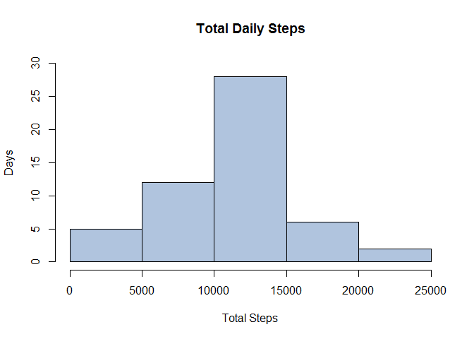
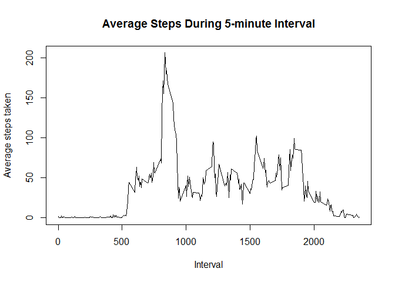
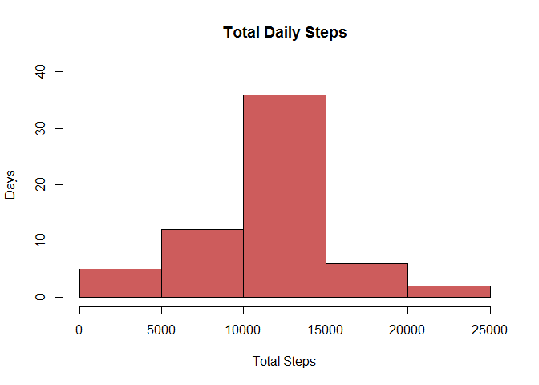
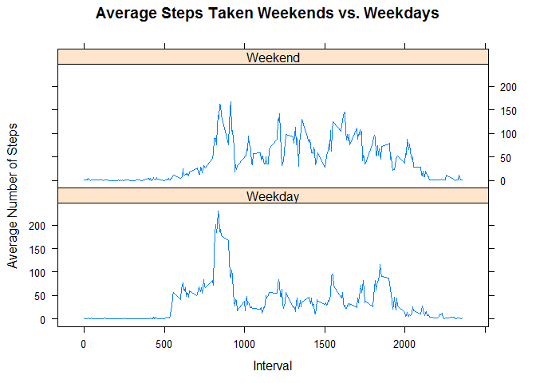

# Reporoducible Research Project 1
Rebecca Love  
January 15, 2017  

###Loading and preprocessing the data


```r
# load dplyr to use for data summaries
library(dplyr)
```

```
## 
## Attaching package: 'dplyr'
```

```
## The following objects are masked from 'package:stats':
## 
##     filter, lag
```

```
## The following objects are masked from 'package:base':
## 
##     intersect, setdiff, setequal, union
```

```r
library(ggplot2)

# 
## Load the data:  unzip and read the data into a variable, clean up environment
activity <- unzip("repdata%2Fdata%2Factivity.zip", overwrite = TRUE, exdir = ".")
rawactivitydata <- read.csv(activity, header = TRUE)
rm(activity)

## Process/transform the data into a format suitable for analysis
# create dataframe without NAs
activitydata <- na.omit(rawactivitydata)

# test for date class and convert to Date class if necessary
varClass <- class(activitydata$date)
if (varClass != "Date") {
     activitydata$date <- as.Date(activitydata$date)
}
```

###What is mean total number of steps taken per day?


```r
options(scipen=999, digits=20)
# calculate the number of steps taken per day
activitydata.dailysteps <- activitydata %>% group_by(date) %>% summarise(Total.Steps = sum(steps))

#  make a histogram of the total number of steps taken each day
hist(activitydata.dailysteps$Total.Steps, main = "Total Daily Steps", ylim = c(0,30), ylab = "Days", xlab = "Total Steps", col = "lightsteelblue")
```



```r
# calculate the mean of the total number of steps taken each day
activitydata.dailysteps.mean <- mean(activitydata.dailysteps$Total.Steps)


# calculate the mean of the total number of steps taken each day
activitydata.dailysteps.median <- median(activitydata.dailysteps$Total.Steps)
activitydata.dailysteps.mean
```

```
## [1] 10766.188679245282
```

```r
activitydata.dailysteps.median
```

```
## [1] 10765
```
The mean of the total number of steps taken each day is 10766.1886792453.
The median of the total number of steps taken each day is 10765.

###What is the average daily activity pattern?
Make a time series plot (i.e. type = "l") of the 5-minute interval (x-axis) and the average number of steps taken, averaged across all days (y-axis)


```r
# calculate and store average number of steps by interval
activitydata.interval.mean <- summarise(group_by(activitydata, interval), AverageSteps = mean(steps))

# create the plot
plot(activitydata.interval.mean$interval, activitydata.interval.mean$AverageSteps, type = "l", xlab = "Interval", ylab = "Average steps taken", main = "Average Steps During 5-minute Interval")
```



Which 5-minute interval, on average across all the days in the dataset, contains the maximum number of steps?


```r
maxstepsinterval <- activitydata.interval.mean$interval[which.max(activitydata.interval.mean$AverageSteps)]
maxstepsinterval
```

```
## [1] 835
```
On average across all the days in the dataset, 5-minute interval number 835 contains the maximum number of steps.  

### Imputing missing values

1. Calculate and report the total number of missing values in the dataset (i.e. the total number of rows with NAs)


```r
totalmissing <- sum(is.na(rawactivitydata))
totalmissing
```

```
## [1] 2304
```
The total number of missing values in the dataset is 2304.

2. Devise a strategy for filling in all of the missing values in the dataset. The strategy does not need to be sophisticated. For example, you could use the mean/median for that day, or the mean for that 5-minute interval, etc.

Strategy:  Set NA values to the average of the corresponding interval

3. Create a new dataset that is equal to the original dataset but with the missing data filled in.


```r
# start with raw data
activitydata.fillna <- rawactivitydata

# test for date class and convert to Date class if necessary
varClass <- class(activitydata.fillna$date)
if (varClass != "Date") {
     activitydata.fillna$date <- as.Date(activitydata.fillna$date)
}

# loop through the data frame setting na values to corresponding interval average
for (i in 1:nrow(activitydata.fillna))  {
     if(is.na(activitydata.fillna$steps[i])) {
          thisinterval <- which(activitydata.fillna$interval[i] == activitydata.interval.mean$interval);
          #  print(thisinterval)
          activitydata.fillna$steps[i] <-  activitydata.interval.mean[thisinterval,]$AverageSteps
     }
     
}
```

4. Make a histogram of the total number of steps taken each day and Calculate and report the mean and median total number of steps taken per day. Do these values differ from the estimates from the first part of the assignment? What is the impact of imputing missing data on the estimates of the total daily number of steps?


```r
# options(scipen=999)

## calculate the number of steps taken per day
activitydata.fillna.dailysteps <- summarise(group_by(activitydata.fillna, date), FillNA.Total.Steps = sum(steps))
activitydata.fillna.dailysteps
```

```
## Source: local data frame [61 x 2]
## 
##          date FillNA.Total.Steps
##        (date)              (dbl)
## 1  2012-10-01 10766.188679245282
## 2  2012-10-02   126.000000000000
## 3  2012-10-03 11352.000000000000
## 4  2012-10-04 12116.000000000000
## 5  2012-10-05 13294.000000000000
## 6  2012-10-06 15420.000000000000
## 7  2012-10-07 11015.000000000000
## 8  2012-10-08 10766.188679245282
## 9  2012-10-09 12811.000000000000
## 10 2012-10-10  9900.000000000000
## ..        ...                ...
```

```r
##  make a histogram of the total number of steps taken each day
hist(activitydata.fillna.dailysteps$FillNA.Total.Steps, main = "Total Daily Steps", ylim = c(0,40), ylab = "Days", xlab = "Total Steps", col = "indianred")
```



```r
## calculate the mean of the total number of steps taken each day
activitydata.fillna.dailysteps.mean <- mean(activitydata.fillna.dailysteps$FillNA.Total.Steps)
activitydata.fillna.dailysteps.mean
```

```
## [1] 10766.188679245282
```

```r
## calculate the mean of the total number of steps taken each day
activitydata.fillna.dailysteps.median <- median(activitydata.fillna.dailysteps$FillNA.Total.Steps)
activitydata.fillna.dailysteps.median
```

```
## [1] 10766.188679245282
```

The mean of the total number of steps per day is 10766.1886792453.
The median of the total number of steps per day is 10766.1886792453.  Compared to the NA removed data set, there is no difference in the mean of filled data set.  However, the median has moved slightly higher and is now equal to the mean.  As seen in the histograms, the average number of days increased in interval range 10000 - 15000.


#Are there differences in activity patterns between weekdays and weekends?

For this part the weekdays() function may be of some help here. Use the dataset with the filled-in missing values for this part.

Create a new factor variable in the dataset with two levels - "weekday"" and "weekend" indicating whether a given date is a weekday or weekend day.


```r
library(chron)
activitydata.fillna$daytype <- factor((chron::is.weekend(activitydata.fillna$date)), levels=c(FALSE, TRUE), labels=c("Weekday","Weekend"))
```

Make a panel plot containing a time series plot (i.e. type = "l") of the 5-minute interval (x-axis) and the average number of steps taken, averaged across all weekday days or weekend days (y-axis). See the README file in the GitHub repository to see an example of what this plot should look like using simulated data.

```r
activitydata.fillna.dailystepsaverage <- summarise(group_by(activitydata.fillna, daytype, interval), FillNA.Average.Steps = mean(steps))
activitydata.fillna.dailystepsaverage
```

```
## Source: local data frame [576 x 3]
## Groups: daytype [?]
## 
##    daytype interval FillNA.Average.Steps
##     (fctr)    (int)                (dbl)
## 1  Weekday        0 2.251153039832284986
## 2  Weekday        5 0.445283018867924540
## 3  Weekday       10 0.173165618448637315
## 4  Weekday       15 0.197903563941299793
## 5  Weekday       20 0.098951781970649896
## 6  Weekday       25 1.590356394129978979
## 7  Weekday       30 0.692662473794549260
## 8  Weekday       35 1.137945492662473690
## 9  Weekday       40 0.000000000000000000
## 10 Weekday       45 1.796226415094339668
## ..     ...      ...                  ...
```


```r
library(lattice)
xyplot(activitydata.fillna.dailystepsaverage$FillNA.Average.Steps~activitydata.fillna.dailystepsaverage$interval|activitydata.fillna.dailystepsaverage$daytype, layout = c(1,2), type = "l", xlab =  "Interval", ylab = "Average Number of Steps", main = "Average Steps Taken Weekends vs. Weekdays")
```



